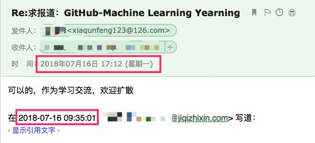

# README

**重要声明！！！**

1、已授权作者认为我是有意扩散的，特此证明不是，以下是邮件截图：

我不太看邮件，在我授权同意之前该文章就已经发出了，也是同事看到后发我才知道的，我看了机器之心的报道，措辞上没有什么问题，于是补了同意，但强调了“用于学习交流”。

2、作者一直强调我的翻译脱离了《著作权法》中对于翻译权所规定的 “为学校课堂教学或者科学研究，翻译已经发表的作品，供教学或者科研人员使用，但不得出版发行” 的特殊范畴

我对此提出疑惑，认为没有，因为我从最开始就是以学习的目的来翻译的，仅仅作为自己的记录，从始至终并没有其他商业想法。所以我这里符合供学习探讨和科研使用的范畴。我再次向其咨询，其并没有给予我解释，而是一味地强调让我删除。

3、作者认为我是在骗取star量

在这里我不同意作者的观点，我从始至终从未主动宣传过，在机器之心报道前就已经有五百多star（远高于作者目前的两百多），都是被别人自发搜索关注的，我只是默默的在做我最初想要做的事情：就是自己在阅读的同时顺便翻译记录下来，方便再次温习，以便更好的理解文章中的内容。上传到github其一是方便管理，其二是能顺便和大家一起学习交流，共同进步。

4、虽然我开源的比较早，又因为仅限于学习目的，再加上工作比较忙，第一次弄这个，没有申请完整版权这个意识，在这一点上比不上开源一个月不到的已授权作者。我已经向NG提交了仅供学习交流的授权申请，等待授权之，暂且先移除翻译内容，给各位小伙伴学习上带来的不便，敬请谅解。

## 简介

NG的手稿，还没有出全。我这里边学习边翻译，随手记录之，加深学习印象，仅供学习交流。 

官网：[http://www.mlyearning.org/](http://www.mlyearning.org/)

> **声明**：本rep是自己学习过程的一个记录，仅用于学习目的，从未主动宣传和寻求关注过，从默默无闻到被这么多人关注深感荣幸。因为仅仅是随笔形式并从未考虑过商业用途，所以版权意识较弱，没有及时申请授权。我也是今天才知道已经有作者近期取得了商业授权并开源（最近一个月内开源的）。该作者已与我取得联系，首先就被动被报道向取得授权的作者深表歉意，其次我们达成以下共识：1、我将增加LISENSE，修改著作权（没弄过，需要研究一下怎么操作）；2、我已经向Andrew Ng申请仅用于学习交流的授权，待回复；3、后续我也会向取得授权作者仓库贡献自己的一些力量，一起让翻译质量更好。

**更新记录：**

- update 2018.02.02：完成1~14章的翻译（DONE）

- update 2018.04.25：NG终于出15~19章的手稿啦，等的好辛苦（DONE）

> Tips：在原先的12章和13章之间新增一个章节 `13 Build your first system quickly, then iterate`，原先的chapter13变为14，chapter14变为15

- update 2018.05.02：手稿 20~22 章已出（DONE）
- update 2018.05.09：手稿 23~27 章已出（DONE）
- update 2018.05.16：手稿 28~30 章已出（DONE）
- update 2018.05.23：手稿 31~32 章已出（DONE）
- update 2018.05.30：手稿 33~35 章已出（DONE）
- update 2018.06.06：手稿 36~39 章已出（DONE）
- update 2018.06.13：手稿 40~43 章已出（DONE）
- update 2018.06.20：手稿 44~46 章已出（DONE）
- update 2018.06.27：手稿 47~49 章已出（DONE）
- update 2018.07.04：手稿 50~52 章已出（DONE）

> 业余时间翻译，水平有限，如有不妥或错误之处，欢迎不吝赐教。
